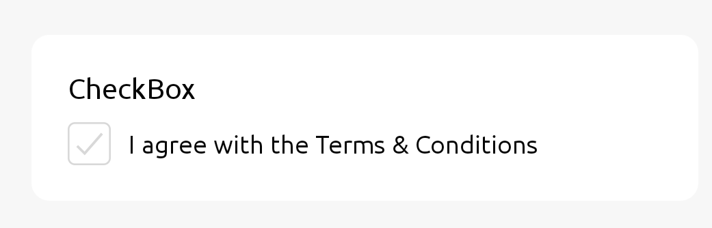
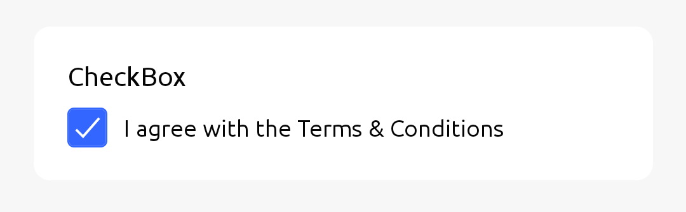

Checkbox is a selection of a `true` or `false`

## Usage

### Simple Usage




```jsx
import { View } from 'react-native';
import { CheckBox, Text } from 'react-native-rapi-ui';

const Forms = () => {
	const [checkBox, setCheckbox] = React.useState(false);
	return (
		<View style={{ flexDirection: 'row', alignItems: 'center' }}>
			<Text style={{ marginBottom: 10 }}>TextInput</Text>
			<CheckBox value={checkBox} onValueChange={(val) => setCheckbox(val)} />
			<Text size="md" style={{ marginLeft: 10, color: 'gray' }}>
				I agree with the Terms & Conditions
			</Text>
		</View>
	);
};

export default Forms;
```

## Properties

|       props        | required |                              value                               | Default Value |
| :----------------: | :------: | :--------------------------------------------------------------: | ------------- |
|     **value**      |   Yes    |                            `boolean`                             | `false`       |
| **onValueChange**  |   Yes    |                  `(newValue: boolean) => void`                   |               |
|      **size**      |    No    |                             `number`                             | 24            |
|  **checkedColor**  |    No    |                             `string`                             | #3366FF       |
| **unCheckedColor** |    No    |                             `string`                             | #d8d8d8       |
|  **inverseColor**  |    No    |                             `string`                             | #FFFFFF       |
|    **disabled**    |    No    |                            `boolean`                             | `false`       |
|     **style**      |    No    | [ViewStyle](https://reactnative.dev/docs/view-style-props#props) |               |
