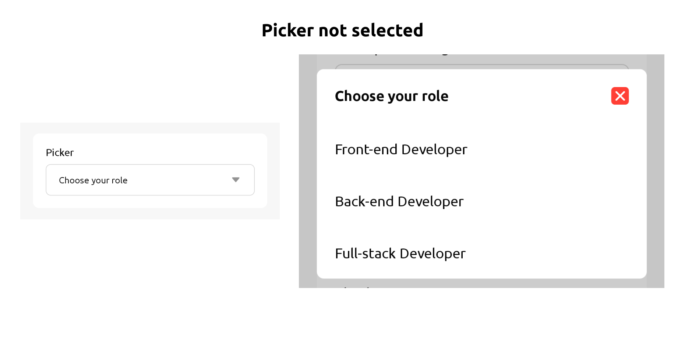
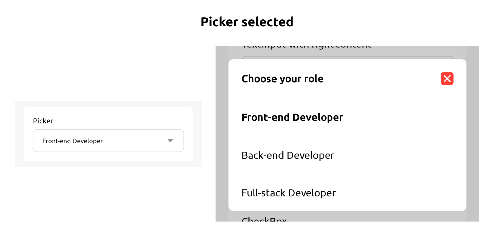

Picker is a modal with options that you can choose 1 selection




## Usage

```jsx
import { View } from 'react-native';
import { Picker, Text, Section, SectionContent } from 'react-native-rapi-ui';

const Forms = () => {
	const [pickerValue, setPickerValue] = React.useState(null);
	const items = [
		{ label: 'Front-end Developer', value: 'FED' },
		{ label: 'Back-end Developer', value: 'BED' },
		{ label: 'Full-stack Developer', value: 'FSD' },
	];
	return (
		<Section style={{ marginHorizontal: 20, marginTop: 20 }}>
			<SectionContent>
				<View>
					<Text style={{ marginBottom: 10 }}>Picker</Text>
					<Picker
						items={items}
						value={pickerValue}
						placeholder="Choose your role"
						onValueChange={(val) => setPickerValue(val)}
					/>
				</View>
			</SectionContent>
		</Section>
	);
};

export default Forms;
```

## Properties

|            props             | required |                value                 | Default Value  |
| :--------------------------: | :------: | :----------------------------------: | -------------- |
|       **placeholder**        |   Yes    |               `string`               |                |
|          **value**           |   Yes    |           `string` `null`            | `false`        |
|      **onValueChange**       |   Yes    |     (newValue: `string`) => void     | null) => void` |
|          **items**           |   Yes    | [{label: `string`, value: `string`}] |                |
|         **disabled**         |    No    |              `boolean`               | `false`        |
|     **backgroundColor**      |    No    |               `string`               | #ffffff        |
|       **borderColor**        |    No    |               `string`               | #d8d8d8        |
|       **borderWidth**        |    No    |               `number`               | 1              |
|       **borderRadius**       |    No    |               `number`               | 8              |
| **selectionBackgroundColor** |    No    |               `string`               | #ffffff        |
|  **selectionBorderRadius**   |    No    |               `number`               | 8`             |
|        **iconColor**         |    No    |               `string`               | #939393        |
|        **labelColor**        |    No    |               `string`               | #000000        |
|      **closeIconColor**      |    No    |               `string`               | #FF3F35        |
|        **labelSize**         |    No    |  `h1` `h2` `h3` `xl` `lg` `md` `sm`  | `lg`           |
|     **placeholderSize**      |    No    |  `h1` `h2` `h3` `xl` `lg` `md` `sm`  | `md`           |
|     **placeholderColor**     |    No    |               `string`               | #939393        |
