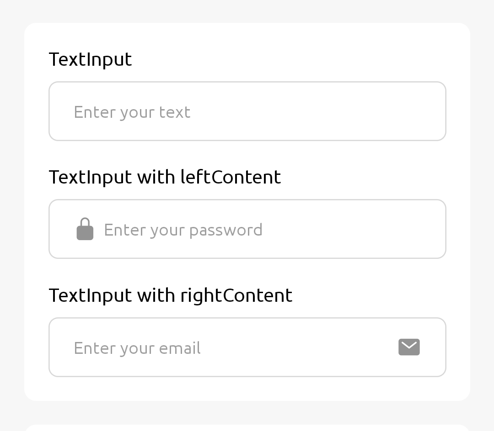
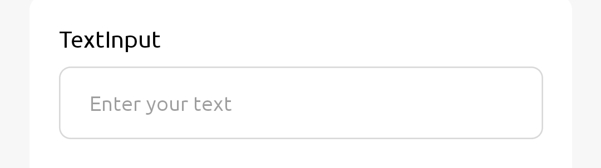
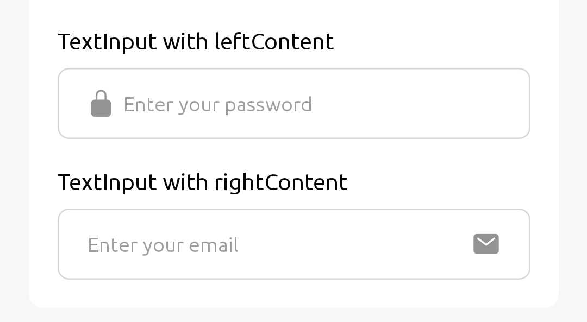

TextInput let users enter and edit text.



## Usage

### Simple Usage



```jsx
import { TextInput } from 'react-native-rapi-ui';

const Forms = () => {
	const [text, setText] = React.useState('');
	return (
		<>
			<Text style={{ marginBottom: 10 }}>TextInput</Text>
			<TextInput
				placeholder="Enter your text"
				value={text}
				onChangeText={(val) => setText(val)}
			/>
		</>
	);
};

export default Forms;
```

### TextInput with Left or Right Content



```jsx
import { View } from 'react-native';
import { TextInput, Text } from 'react-native-rapi-ui';
import { Ionicons } from '@expo/vector-icons';

const Forms = () => {
	const [pass, setPass] = React.useState('');
	const [email, setEmail] = React.useState('');
	return (
		<>
			<View>
				<Text style={{ marginBottom: 10 }}>TextInput with leftContent</Text>
				<TextInput
					placeholder="Enter your password"
					value={pass}
					onChangeText={(val) => setPass(val)}
					leftContent={
						<Ionicons name="lock-closed" size={20} color={theme.gray300} />
					}
				/>
			</View>
			<View>
				<Text style={{ marginBottom: 10 }}>TextInput with rightContent</Text>
				<TextInput
					placeholder="Enter your email"
					value={email}
					onChangeText={(val) => setEmail(val)}
					rightContent={
						<Ionicons name="mail" size={20} color={theme.gray300} />
					}
				/>
			</View>
		</>
	);
};

export default Forms;
```

## Properties

|                               props                                | required |                              value                               | Default Value |
| :----------------------------------------------------------------: | :------: | :--------------------------------------------------------------: | ------------- |
| **[TextInputProps](https://reactnative.dev/docs/textinput#props)** |          |                                                                  |               |
|                         **containerStyle**                         |    No    | [ViewStyle](https://reactnative.dev/docs/view-style-props#props) |               |
|                          **leftContent**                           |    No    |                           `React.Node`                           |               |
|                          **rightContent**                          |    No    |                           `React.Node`                           |               |
|                        **backgroundColor**                         |    No    |                             `string`                             | #FFFFFF       |
|                          **borderWidth**                           |    No    |                             `number`                             | 1             |
|                          **borderRadius**                          |    No    |                             `number`                             | 8             |
|                          **borderColor**                           |    No    |                             `string`                             | #d8d8d8       |
