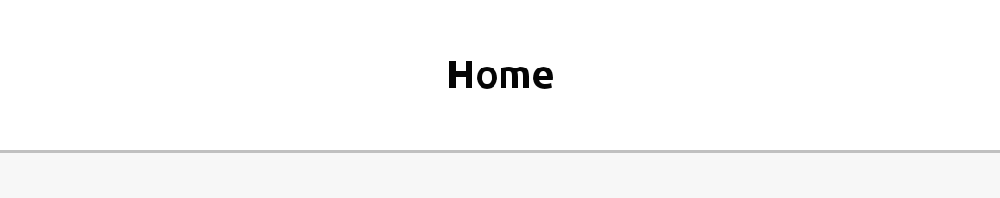
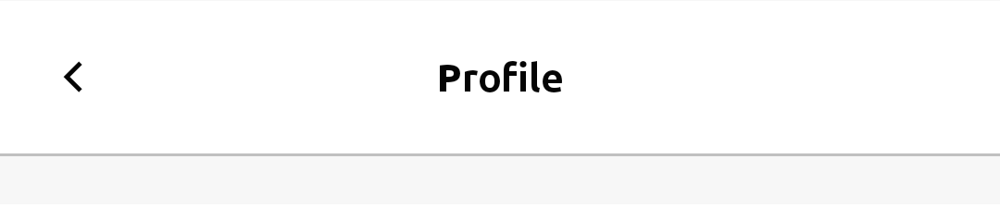
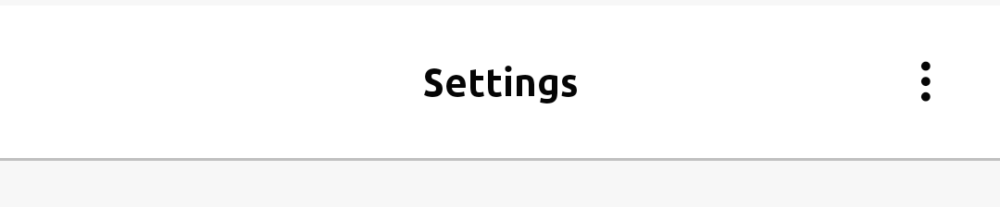

TopNavigation provides a heading component for a page/screen.



## Usage

### Simple Usage

You can simply put your title or your logo on `middleContent`


```jsx
import { Layout, TopNav } from 'react-native-rapi-ui';

<Layout>
    <TopNav middleContent="Home">
</Layout>

```

### Left or Right Content

You can add a content on left or right you can give it an action (`onPress`) too.



```jsx
import { Layout, TopNav } from 'react-native-rapi-ui';

<Layout>
	<TopNav
		leftContent={<Ionicons name="chevron-back" size={20} color={theme.black} />}
		leftAction={() => console.log('back icon pressed')}
		middleContent="Profile"
	/>
	<TopNav
		rightContent={
			<Ionicons name="ellipsis-vertical" size={20} color={theme.black} />
		}
		rightAction={() => console.log('setting icon pressed')}
		middleContent="Settings"
	/>
</Layout>;
```

## Properties

|                          props                           | required |                           value                            | Default Value |
| :------------------------------------------------------: | :------: | :--------------------------------------------------------: | ------------- |
| **[ViewProps](https://reactnative.dev/docs/view#props)** |          |                                                            |               |
|                        **height**                        |    No    |                          `number`                          | 64            |
|                   **backgroundColor**                    |    No    |                          `string`                          | #FFFFFF       |
|                     **borderColor**                      |    No    |                          `string`                          | #c0c0c0       |
|                     **leftContent**                      |    No    |               `string` or `React.ReactNode`                |               |
|                    **middleContent**                     |    No    |               `string` or `React.ReactNode`                |               |
|                     **rightContent**                     |    No    |               `string` or `React.ReactNode`                |               |
|                      **leftAction**                      |    No    |                       `VoidFunction`                       |               |
|                     **middleAction**                     |    No    |                       `VoidFunction`                       |               |
|                     **rightAction**                      |    No    |                       `VoidFunction`                       |               |
|                    **leftTextStyle**                     |    No    | [TextStyle](https://reactnative.dev/docs/text-style-props) |               |
|                   **middleTextStyle**                    |    No    | [TextStyle](https://reactnative.dev/docs/text-style-props) |               |
|                    **rightTextStyle**                    |    No    | [TextStyle](https://reactnative.dev/docs/text-style-props) |               |
