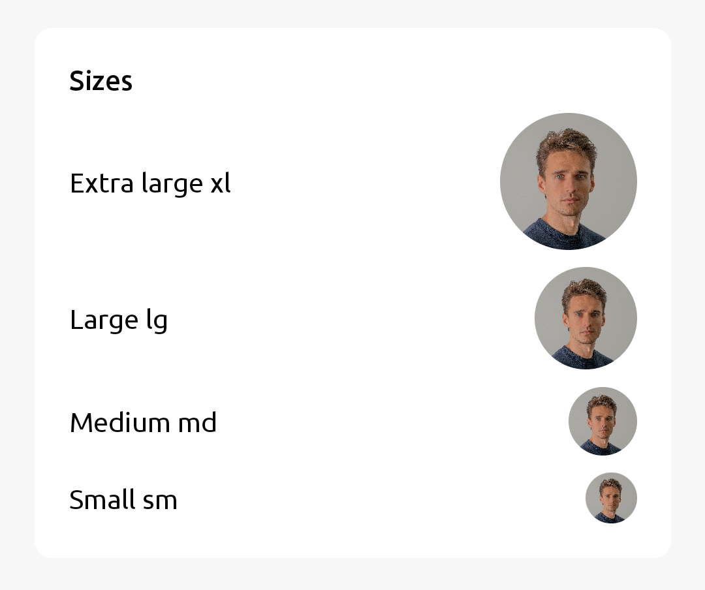
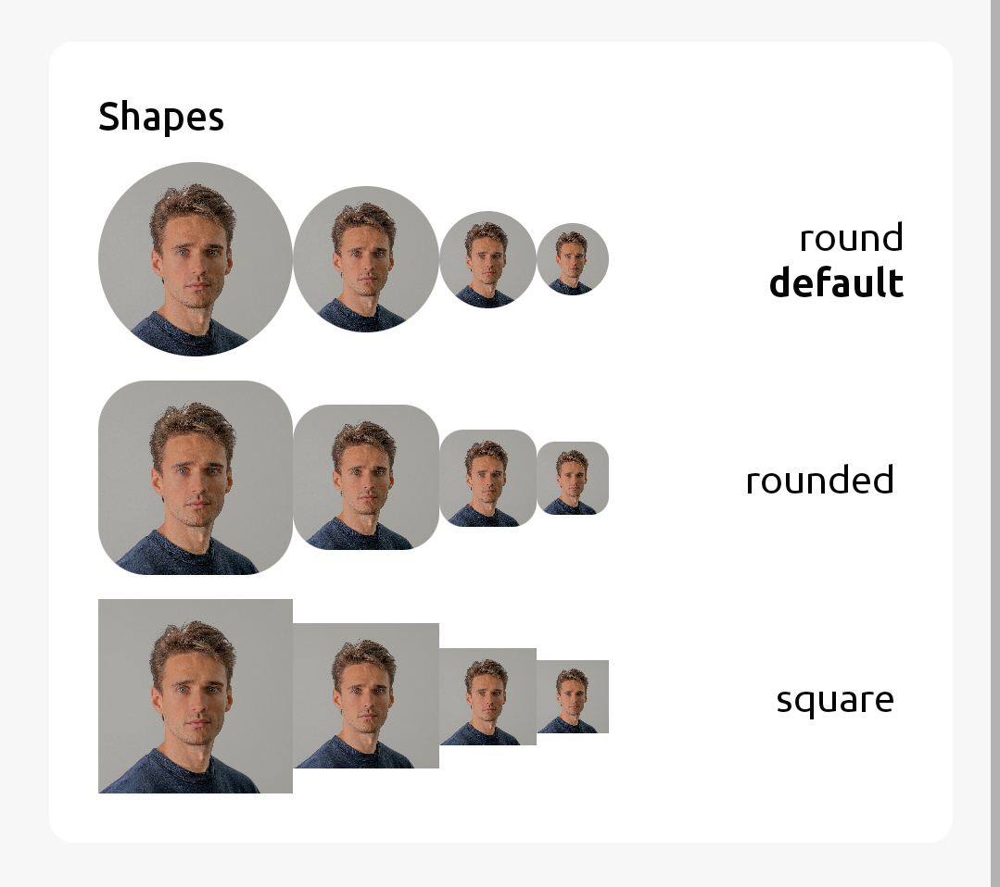

`Avatar` is an `Image` but only take 1:1 ratio of the image


## Usage

### Simple Usage

```jsx
import { Avatar } from 'react-native-rapi-ui';

<Avatar
	source={{ uri: 'https://avatar.com/people' }}
	size="lg"
	shape="round"
/>;
```

## Properties

|   props    | required |                              value                               | Default Value |
| :--------: | :------: | :--------------------------------------------------------------: | ------------- |
| **source** |   Yes    | [ImageSourcePropType](https://reactnative.dev/docs/image#source) |               |
|  **size**  |    No    |                       `xl` `lg` `md` `sm`                        | `lg`          |
| **shape**  |    No    |                    `round` `rounded` `square`                    | `round`       |
