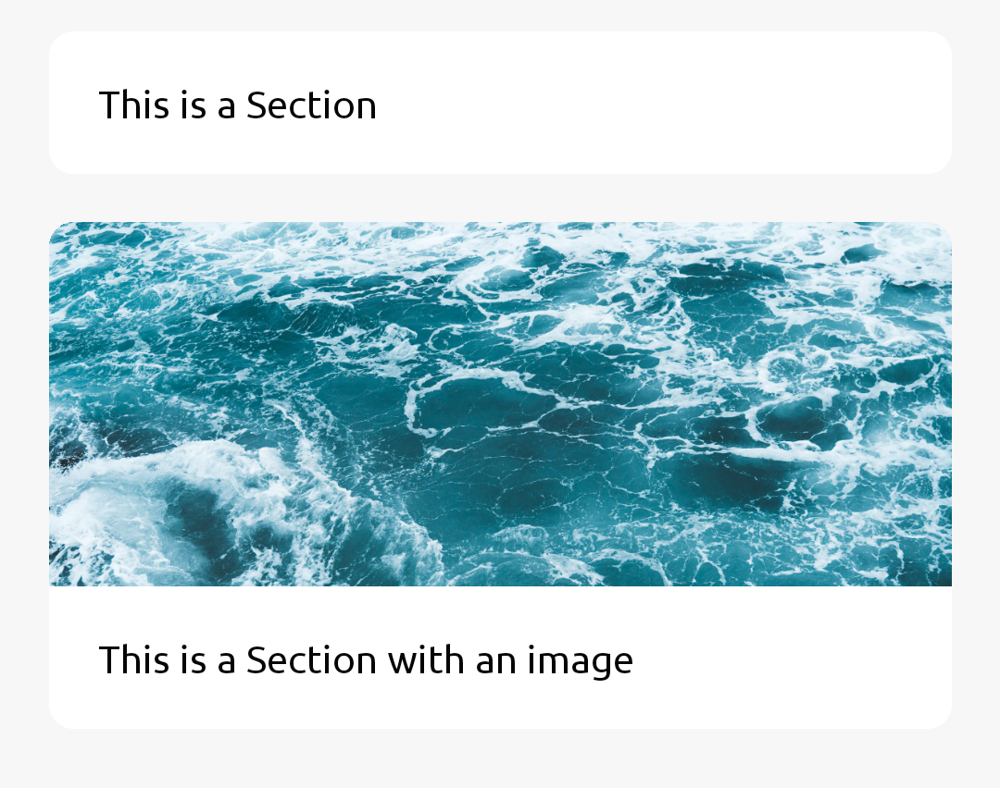
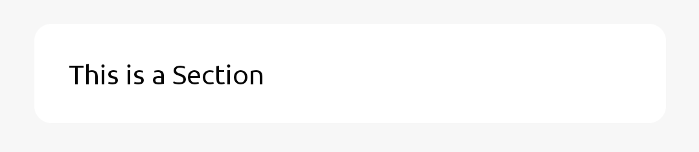
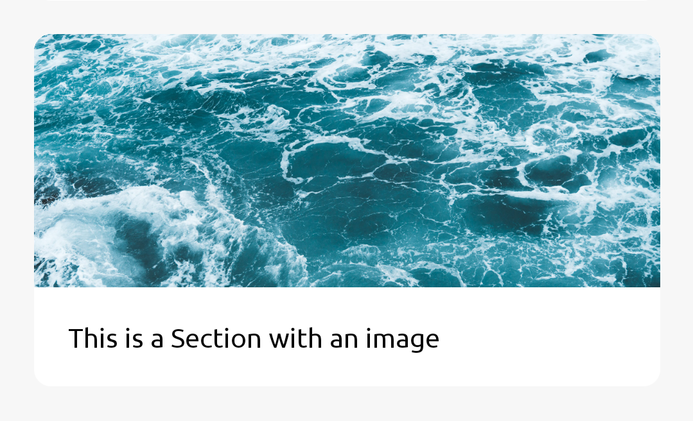

Section is a wrapper for your content



## Usage

### Simple Usage



use `<SectionContent/>` to have a padding on your `<Section/>`

```jsx
import { Section, SectionContent } from 'react-native-rapi-ui';

<Section>
	<SectionContent>
		<Text>This is a Section</Text>
	</SectionContent>
</Section>;
```

### Section with Image



use `<SectionContent/>` to have a padding on your `<Section/>`

```jsx
import { Section, SectionContent, SectionImage } from 'react-native-rapi-ui';

<Section>
	<SectionImage source={require('assets/image.jpg')} />
	<SectionContent>
		<Text>This is a Section with an image</Text>
	</SectionContent>
</Section>;
```

## Properties

### Section

|                          props                           | required |  value   | Default Value |
| :------------------------------------------------------: | :------: | :------: | ------------- |
| **[ViewProps](https://reactnative.dev/docs/view#props)** |          |          |               |
|                   **backgroundColor**                    |    No    | `string` | #FFFFFF       |
|                     **borderRadius**                     |    No    | `number` | 10            |

### SectionContent

|                          props                           | required |  value   | Default Value |
| :------------------------------------------------------: | :------: | :------: | ------------- |
| **[ViewProps](https://reactnative.dev/docs/view#props)** |          |          |               |
|                       **padding**                        |    No    | `number` | 20            |

### SectionImage

|   props    | required |                              value                               | Default Value |
| :--------: | :------: | :--------------------------------------------------------------: | ------------- |
| **source** |   Yes    | [ImageSourcePropType](https://reactnative.dev/docs/image#source) |               |
| **height** |    No    |                             `number`                             | 150           |
